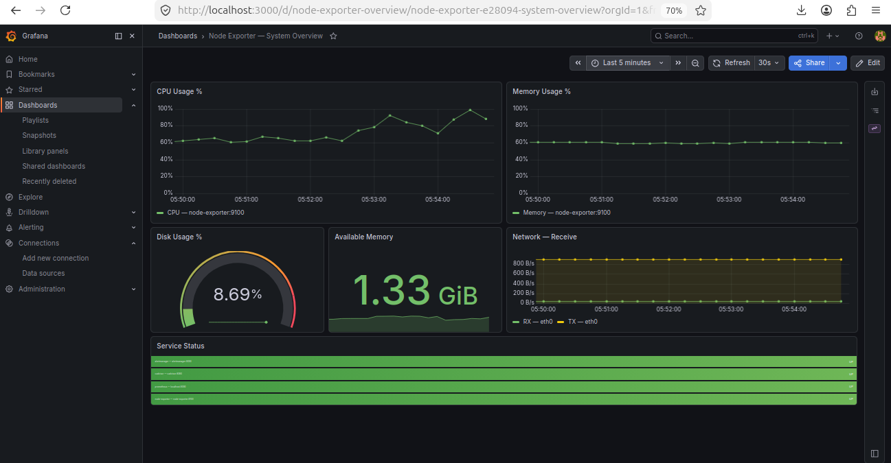
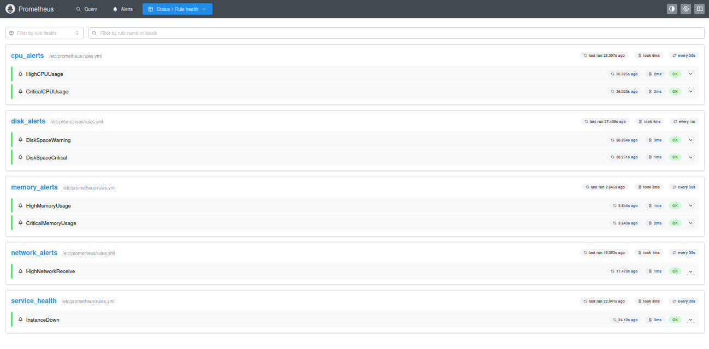
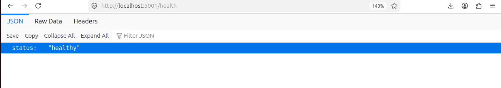

# Cloud Monitoring Platform
 
A production-ready monitoring stack built with Docker Compose, featuring real-time metrics, alerting, and dashboards — all configured as code.
 
## Stack
 
| Service | Role | Port |
|---------|------|------|
| Prometheus | Metrics collection & alerting | 9090 |
| Grafana | Dashboards & visualization | 3000 |
| Alertmanager | Alert routing & notifications | 9093 |
| Node Exporter | Host system metrics | 9100 |
| cAdvisor | Container metrics | 8080 |
| Webhook Receiver | Alert webhook handler | 5001 |
 
## Getting Started
 
### Prerequisites
- Docker
- Docker Compose
### Run
 
git clone https://github.com/M0az2/cloud-monitoring-platform.git
cd cloud-monitoring-platform
docker compose up -d
docker compose ps
 
### Access
 
| URL | Credentials |
|-----|-------------|
| http://localhost:3000 | admin / admin |
| http://localhost:9090 | — |
| http://localhost:9093 | — |
| http://localhost:5001/health | — |
 
## Features
 
### Grafana Provisioning
Datasource and dashboards are automatically configured on startup — no manual setup required.
 
### Alert Rules
 
| Alert | Condition | Severity |
|-------|-----------|----------|
| InstanceDown | target unreachable > 1m | critical |
| HighCPUUsage | CPU > 80% for 5m | warning |
| CriticalCPUUsage | CPU > 95% for 2m | critical |
| HighMemoryUsage | Memory > 80% for 5m | warning |
| CriticalMemoryUsage | Memory > 95% for 2m | critical |
| DiskSpaceWarning | Disk > 75% for 5m | warning |
| DiskSpaceCritical | Disk > 90% for 2m | critical |
| HighNetworkReceive | RX > 100MB/s for 5m | warning |
 
### Webhook Receiver
 
curl http://localhost:5001/alerts
curl http://localhost:5001/health
 
## CI/CD
 
GitHub Actions runs on every push and PR to main:
 
- Validate prometheus.yml
- Validate rules.yml
- Validate alertmanager.yml
- Validate docker-compose.yml
- Build webhook-receiver Docker image
## Project Structure
 
cloud-monitoring-platform/
├── prometheus/
│   ├── prometheus.yml
│   └── rules.yml
├── grafana/
│   └── provisioning/
│       ├── datasources/
│       └── dashboards/
├── alertmanager/
│   └── alertmanager.yml
├── webhook-receiver/
│   ├── app.py
│   ├── Dockerfile
│   └── requirements.txt
├── .github/
│   └── workflows/
│       └── ci.yml
├── docker-compose.yml
└── .env.example
 
## Screenshots
 
### Grafana Dashboard

 
### Prometheus Alert Rules

 
### Webhook Receiver

 
## Useful Commands
 
```bash
docker compose up -d
docker compose down
docker compose logs -f
docker compose restart grafana
docker compose ps
